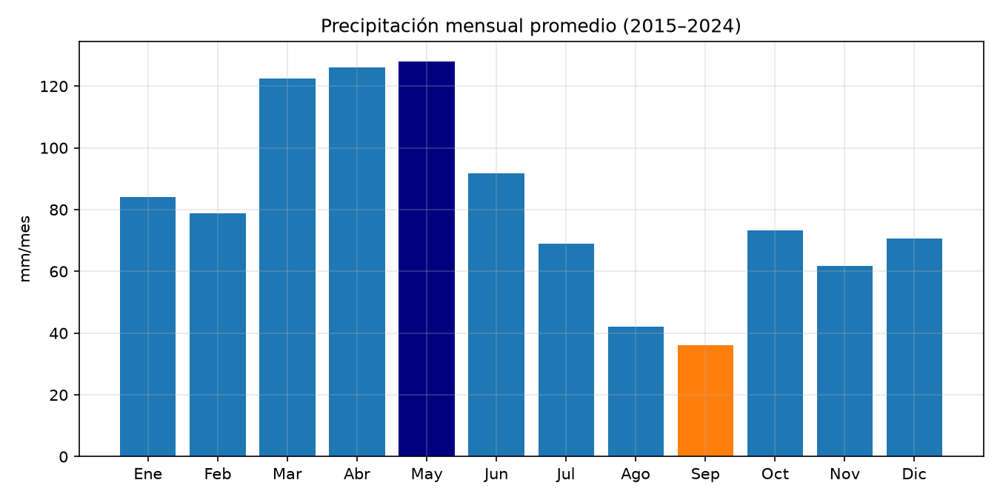
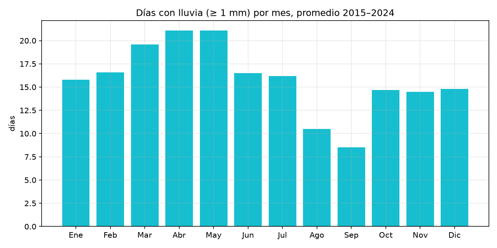
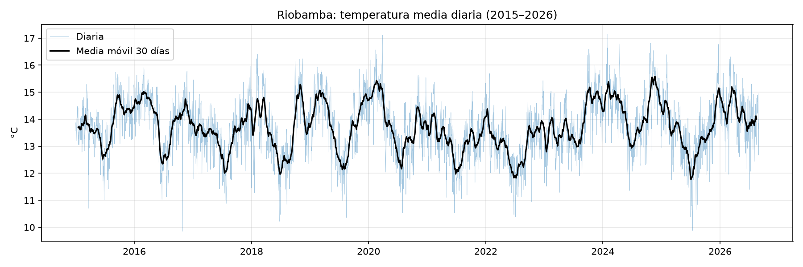
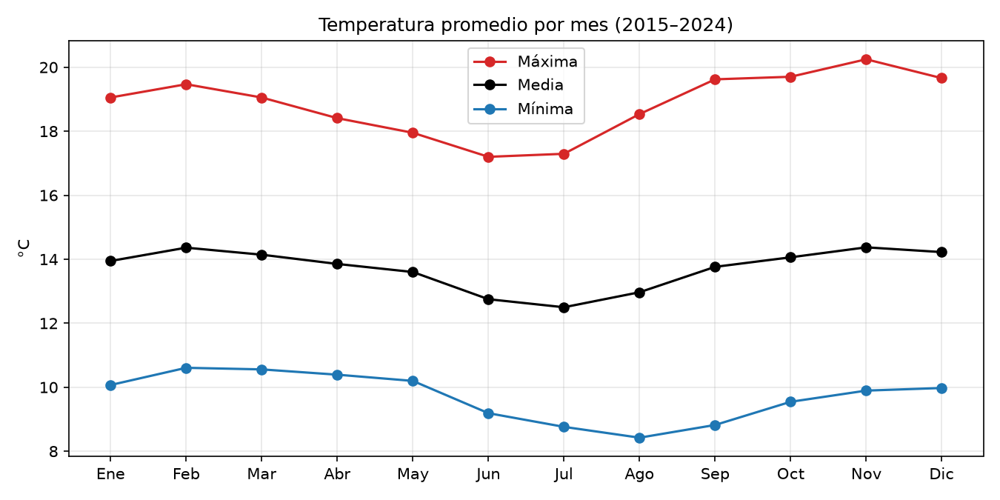
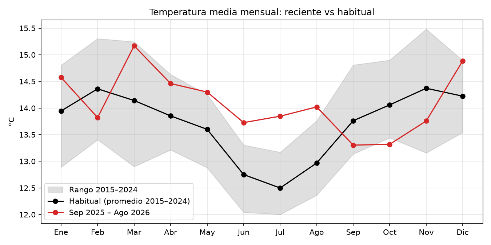
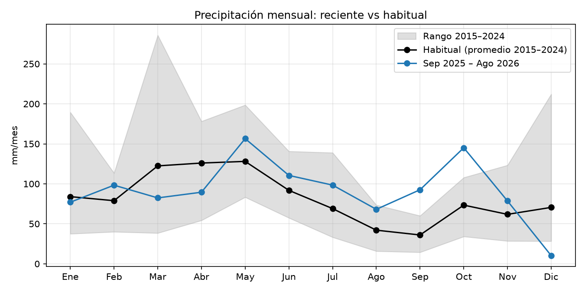

# Clima de Riobamba (2015–2026):

**Maestría en Ciencia de Datos: Tarea 01**

Adquisición, visualización y análisis de datos meteorológicos diarios de Riobamba-Ecuador, obtenidos de la API gratuita de https://open-meteo.com/.

## 1. Preguntas

1. ¿Cuáles son los meses más lluviosos y más secos en Riobamba?
2. ¿Cómo varía la temperatura a lo largo del año en Riobamba?
3. ¿El clima reciente de Riobamba está siendo diferente de su comportamiento habitual?

## 2. Datos

| Característica | Valor |
|---|---|
| Fuente | Open-Meteo |
| Ubicación | Riobamba: 1.652°S, 78.652°W, 2772 msnm |
| Periodo | 1 de enero de 2015-31 de agosto de 2026 |
| Registros | 4261 días |
| Variables | Temperatura media, máxima y mínima a 2m en °C, precipitación diaria en mm |
| Archivo local | `data/raw/riobamba_daily_2015-01-01_2026-08-31.csv` |

## 3. Estructura del repositorio

```
├── data/raw/          # datos descargados en .csv
├── figures/           # gráficas generadas
├── src/
│   ├── 01_descarga.py # se lee los datos desde la API, los descarga y los guarda en .csv
│   └── 02_analisis.py # se calculan resultados y se generan las gráficas
├── requirements.txt
└── README.md
```

## 4. Proceso

1. **Descarga** 
`01_descarga.py` consulta la API con el script base que genera Open-Meteo y guarda los datos en un .csv local.
2. **Datos mensuales** 
`02_analisis.py` agrupa los datos diarios por mes:
   - **Temperatura:** promedio de los días del mes.
   - **Precipitación:** suma de la lluvia del mes.
   - **Días con lluvia:** número de días del mes con al menos 1 mm.
3. **Comportamiento habitual** 
Para cada mes del calendario se calcula el promedio de 2015–2024, junto con el valor mínimo y máximo observado en esos años.
4. **Periodo reciente** 
Los últimos 12 meses completos (septiembre 2025–agosto 2026) se comparan con lo habitua (promedio de los últimos 10 años). La base termina en 2024 para que ambos periodos no se solapen.
5. **Gráficas** 
Se generan seis gráficas con Matplotlib.

## 5. Resultados

### Pregunta 1: ¿Cuáles son los meses más lluviosos y más secos?





| Mes | Ene | Feb | Mar | Abr | May | Jun | Jul | Ago | Sep | Oct | Nov | Dic |
|---|---:|---:|---:|---:|---:|---:|---:|---:|---:|---:|---:|---:|
| Lluvia (mm) | 84.0 | 78.9 | 122.4 | 126.0 | **128.0** | 91.8 | 69.0 | 42.0 | **36.0** | 73.4 | 61.8 | 70.5 |
| Días con lluvia | 15.8 | 16.6 | 19.6 | 21.1 | 21.1 | 16.5 | 16.2 | 10.5 | 8.5 | 14.7 | 14.5 | 14.8 |

**Respuesta**

- Meses más lluviosos: marzo, abril y mayo. Superan los 120 mm y registran unos 20 días con lluvia al mes. Mayo es el más lluvioso.
- Meses más secos: agosto y septiembre. Tienen alrededor de 40 mm y entre 8 y 11 días con lluvia. Septiembre es el más seco.

### Pregunta 2: ¿Cómo varía la temperatura a lo largo del año?





| Mes | Ene | Feb | Mar | Abr | May | Jun | Jul | Ago | Sep | Oct | Nov | Dic |
|---|---:|---:|---:|---:|---:|---:|---:|---:|---:|---:|---:|---:|
| T media (°C) | 13.9 | 14.4 | 14.1 | 13.9 | 13.6 | 12.8 | **12.5** | 13.0 | 13.8 | 14.1 | **14.4** | 14.2 |

**Respuesta**

- La temperatura media varía ligeramente durante el año, con un mínimo de  12.5 °C y máximo de 14.4 °C.
- Junio, julio y agosto son los meses más fríos, julio es el de menor temperatura. Noviembre y febrero son los más cálidos.
- La diferencia entre el mes más cálido y el más frío es de 1.9 °C.
- En cambio, dentro de un mismo día la temperatura puede subir y baja en promedio 9.1 °C.

### Pregunta 3: ¿El clima reciente está siendo diferente del habitual?

- La línea negra es el promedio habitual de cada mes (2015–2024).
- La banda gris es el rango entre el valor más bajo y el más alto de ese mes en 2015–2024.
- La línea de color son los últimos 12 meses: los puntos de enero a agosto son de 2026 y los de septiembre a diciembre son de 2025.
- Cada punto se compara con su mismo mes. Un punto fuera de la banda gris indica un mes más extremo que cualquiera de los 10 años previos.





| Mes | T reciente (°C) | T habitual (°C) | Diferencia (°C) | Lluvia reciente (mm) | Lluvia habitual (mm) |
|---|---:|---:|---:|---:|---:|
| Sep 2025 | 13.3 | 13.8 | −0.5 | **92.6** ▲ | 36.0 |
| Oct 2025 | **13.3** ▼ | 14.1 | −0.7 | **145.1** ▲ | 73.4 |
| Nov 2025 | 13.8 | 14.4 | −0.6 | 78.6 | 61.8 |
| Dic 2025 | 14.9 | 14.2 | +0.7 | **10.2** ▼ | 70.5 |
| Ene 2026 | 14.6 | 13.9 | +0.6 | 77.0 | 84.0 |
| Feb 2026 | 13.8 | 14.4 | −0.5 | 98.3 | 78.9 |
| Mar 2026 | 15.2 | 14.1 | +1.0 | 82.4 | 122.4 |
| Abr 2026 | 14.5 | 13.9 | +0.6 | 89.5 | 126.0 |
| May 2026 | **14.3** ▲ | 13.6 | +0.7 | 156.5 | 128.0 |
| Jun 2026 | **13.7** ▲ | 12.8 | +1.0 | 110.5 | 91.8 |
| Jul 2026 | **13.8** ▲ | 12.5 | +1.3 | 98.4 | 69.0 |
| Ago 2026 | **14.0** ▲ | 13.0 | +1.1 | 68.1 | 42.0 |
| **Total / promedio** | | | **+0.39** | **1107** | **984** |

▲ / ▼: por encima / por debajo de cualquier valor de ese mes en 2015–2024.

**Respuesta**

Sí, el clima reciente muestra diferencias con el mostrado en años previos.

- **Temperatura**
  - Septiembre-noviembre de 2025 fue más frío de lo visto en los últimos 10 años.
  - Desde diciembre 2025, casi todos los meses fueron más cálidos en comparación con años previos.
  - Los meses de Mayo a agosto 2026 fueron más cálido que cualquier año de 2015–2024, registrando un máximo de +1.3°C en julio.
  - En promedio, los últimos 12 meses fueron 0.39°C más cálidos.
- **Lluvia**
  - El total fue un 12.5% mayor de lo habitual (1107mm frente a 984mm).
  - Hubo un cambio en su distribución a lo largo del año, los meses de septiembre y octubre de 2025 que en años anteriores fueron normalmente secos ahora fueron los más lluviosos de la serie.
  - Diciembre 2025 fue el más seco de la serie para ese mes.
  - Marzo y abril 2026 recibieron cerca de un 30 % menos lluvia de lo visto en años previos.